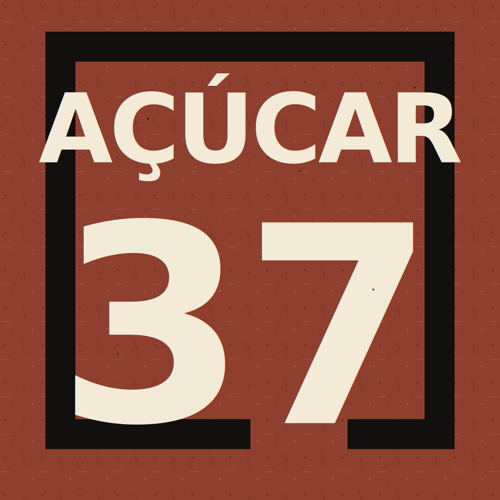

# AÇÚCAR 37 — Website institucional

Website estático bilingue (Português / Inglês) para **AÇÚCAR 37 - Cooperativa de Atividades Culturais, CRL**.

O projecto foi criado para publicação directa no GitHub Pages, sem backend, frameworks ou dependências obrigatórias. O objectivo é apresentar a cooperativa de forma clara, institucional e transparente, incluindo informação útil para processos de validação de organizações sem fins lucrativos.

## Ficheiros

- `index.html` — estrutura semântica, SEO, Open Graph e dados estruturados Schema.org.
- `style.css` — estilos responsivos, paleta visual, acessibilidade e layout.
- `script.js` — selector de idioma PT / EN, menu mobile e ano automático no rodapé.
- `sitemap.xml` — mapa do site para motores de pesquisa.
- `robots.txt` — instruções básicas de indexação.
- `README.md` — instruções de manutenção e publicação.

## Publicação no GitHub Pages

1. Criar um repositório no GitHub ou utilizar o repositório existente.
2. Colocar estes ficheiros na raiz do repositório.
3. Confirmar que o ficheiro principal se chama `index.html`.
4. Fazer commit e push para a branch principal (`main` ou `master`).
5. No GitHub, abrir **Settings** → **Pages**.
6. Em **Build and deployment**, escolher:
   - **Source**: `Deploy from a branch`
   - **Branch**: `main` (ou a branch usada)
   - **Folder**: `/ (root)`
7. Guardar as alterações.
8. Aguardar a publicação. O GitHub Pages indicará o URL público.

## Domínio próprio

O site está preparado para `https://acucar37.pt/`. Se for usado outro domínio:

1. Actualizar as URLs em `index.html`:
   - `link rel="canonical"`
   - `link rel="alternate"`
   - propriedades Open Graph (`og:url`)
   - campo `url` nos dados estruturados Schema.org
2. Actualizar `sitemap.xml` com o domínio correcto.
3. Actualizar `robots.txt` com o URL correcto do sitemap.
4. Configurar o domínio em **Settings** → **Pages** → **Custom domain**.
5. Criar os registos DNS indicados pelo GitHub Pages.

## Substituição do logótipo

Enquanto o logótipo final não existir, o cabeçalho usa uma marca tipográfica com o texto `AÇÚCAR 37`.

Quando o ficheiro oficial estiver disponível:

1. Criar a pasta `assets/` na raiz do projecto.
2. Colocar o ficheiro, por exemplo `assets/logo.svg` ou `assets/logo.png`.
3. Em `index.html`, substituir o bloco da marca dentro de `<a class="brand">` por:

```html

```

4. Ajustar dimensões no CSS, se necessário.

## Editar textos e traduções

O idioma predefinido é Português. O conteúdo em Inglês é aplicado sem recarregar a página através de `script.js`.

Para alterar ou adicionar textos:

1. Abrir `script.js`.
2. Editar o objecto `translations`.
3. Manter a mesma chave em `pt` e `en`.
4. No HTML, associar o texto a um atributo `data-i18n="nomeDaChave"`.

Exemplo:

```html
<p data-i18n="novoTexto">Texto em Português por defeito.</p>
```

```js
translations.pt.novoTexto = "Texto em Português";
translations.en.novoTexto = "Text in English";
```

## Redes sociais

Os links de Instagram, Facebook, YouTube e LinkedIn estão preparados no rodapé da secção de contactos. Substituir `href="#"` pelos URLs oficiais quando estiverem disponíveis.

## Documentos institucionais

A secção de Transparência inclui cartões preparados para:

- Estatutos
- Relatórios de Actividades
- Documentação Institucional

Quando os documentos forem publicados:

1. Criar uma pasta `docs/`.
2. Guardar os PDFs com nomes claros, por exemplo `docs/estatutos-acucar37.pdf`.
3. Substituir o texto de estado por ligações directas para cada documento.

## SEO e validação institucional

O site inclui:

- HTML semântico.
- Meta tags de descrição e indexação.
- Open Graph e Twitter Cards.
- `hreflang` para Português e Inglês.
- Dados estruturados Schema.org com nome legal, NIF, email, morada e natureza cultural.
- `sitemap.xml` e `robots.txt`.

Estas informações ajudam motores de pesquisa e avaliadores de programas para organizações sem fins lucrativos a identificar a entidade, a morada, o estatuto não lucrativo, o sector cultural e o contacto oficial.

## Acessibilidade e performance

- Navegação por teclado com foco visível.
- Link para saltar para o conteúdo principal.
- Contraste adequado.
- Layout responsivo para telemóvel e desktop.
- CSS e JavaScript sem bibliotecas externas.
- Mapa carregado com `loading="lazy"`.

## Teste local

Pode abrir `index.html` directamente no navegador. Para testar com um servidor local simples:

```bash
python3 -m http.server 8000
```

Depois abrir:

```text
http://localhost:8000
```
